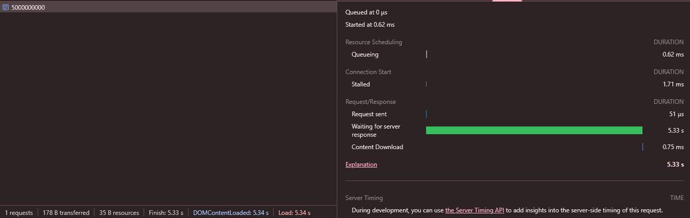
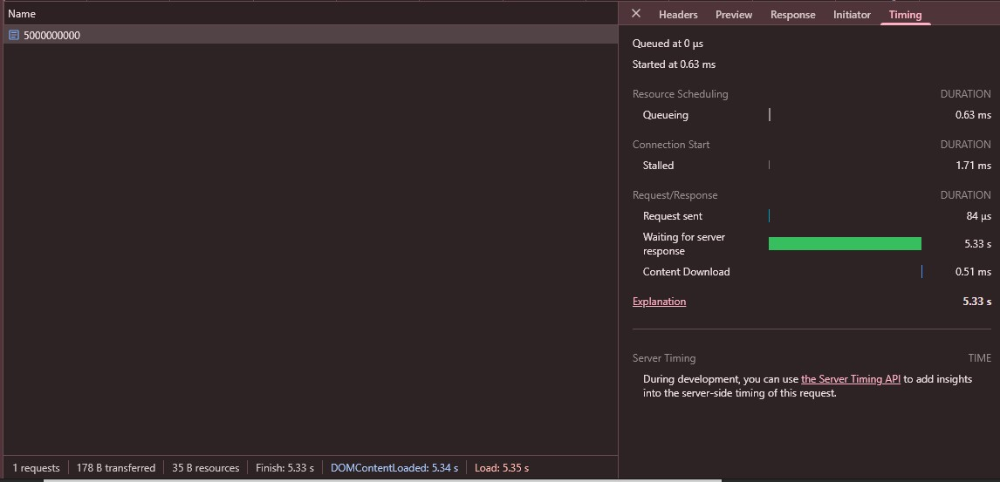

# Introducción a la Práctica de Clúster con Node.js y Express

En esta práctica, exploraremos cómo mejorar el rendimiento de una aplicación Node.js mediante el uso de clústeres de procesos. Debido a que Node.js opera en un solo hilo, en sistemas con múltiples núcleos de CPU, no se aprovecha completamente la capacidad del hardware. La solución a este problema es el uso del módulo cluster, que permite la creación de múltiples procesos secundarios que comparten la carga de trabajo de manera eficiente.

El objetivo de esta práctica es:

- Comprender cómo funciona el módulo cluster en Node.js.
- Implementar una aplicación sin clúster y evaluar su rendimiento.
- Modificar la aplicación para que utilice múltiples procesos y comparar los resultados.
- Utilizar herramientas como PM2 para administrar y optimizar la ejecución de procesos en clúster.
- Analizar métricas de rendimiento con loadtest para evaluar el impacto de la agrupación en clúster.

## Prerrequisitos

Para completar esta práctica, necesitarás tener instalado Node.js en tu sistema. Puedes descargar la última versión de Node.js desde el [sitio web oficial](https://nodejs.org/es/download) o instalarla a través de un gestor de paquetes como npm o yarn.

## Sin cluster

Para observar los beneficios de utilizar clústeres, comenzaremos con una aplicación de prueba en Node.js que no emplea clústeres y la compararemos con una versión que sí los utiliza:

Creamos un directorio para el proyecto.

Dentro del directorio ejecutaremos los siguientes comandos:

```bash
# Este comando creará la estructura de carpetas y el archivo package.json
npm init 
```

```bash
# Este comando instalará el módulo express
npm install express
```

Dentro del directorio crearemos un archivo llamado `index.js` y agregaremos el siguiente código:

```javascript
const express = require("express");
const app = express();
const port = 3000;
const limit = 5000000000;

app.get("/", (req, res) => {
    res.send("Hello World!");
});

app.get("/api/:n", function (req, res) {
    let n = parseInt(req.params.n);
    let count = 0;
    if (n > limit) n = limit;
    for (let i = 0; i <= n; i++) {
        count += i;
    }
    res.send(`Final count is ${count}`);
});

app.listen(port, () => {
    console.log(`App listening on port ${port}`);
});
```

Y desde el directorio de la aplicación ejecutamos el siguiente comando:

```bash
node index.js
```

Accede a la aplicación desde tu navegador en la dirección [http://localhost:3000/api/50](http://localhost:3000/api/50).

Utilizando un valor relativamente pequeño como es `50` comprobamos que la aplicación responde de manera rápida, devolviendo una respuesta de manera inmediata.


Ahora, intenta acceder a la dirección [http://localhost:3000/api/5000000000](http://localhost:3000/api/5000000000).

Utilizando un valor tan grande como `5000000000`, la aplicación tardará en responder debido a que el cálculo es muy costoso y se ejecuta en un solo hilo.



Ahora si tratamos de acceder a la dirección [http://localhost:3000/api/50](http://localhost:3000/api/50) en otra pestaña diferente mientras se está realizando el cálculo de `5000000000`, la aplicación no responderá hasta que termine el cálculo.

Como podemos observar en la siguiente imagen:


Se puede ver que el tiempo de respuesta es más lento que cuando se realizó el cálculo de `50` sin tener el cálculo de `5000000000` a la vez, esto se debe a que el único subproceso que tiene la aplicación está ocupado realizando el cálculo de `5000000000`.

## Con clusters

Ahora utilizaremos el módulo `cluster` para crear un clúster de procesos que comparten la carga de trabajo.

Para ello, cambiaremos el archivo `index.js` de la siguiente manera:

```javascript
const express = require("express");
const port = 3000;
const limit = 5000000000;
const cluster = require("cluster");
const totalCPUs = require("os").cpus().length;

if (cluster.isMaster) {
    console.log(`Number of CPUs is ${totalCPUs}`);
    console.log(`Master ${process.pid} is running`);

    // Fork workers.
    for (let i = 0; i < totalCPUs; i++) {
        cluster.fork();
    }

    cluster.on("exit", (worker, code, signal) => {
        console.log(`worker ${worker.process.pid} died`);
        console.log("Let's fork another worker!");
        cluster.fork();
    });
} else {
    const app = express();

    console.log(`Worker ${process.pid} started`);

    app.get("/", (req, res) => {
        res.send("Hello World!");
    });

    app.get("/api/:n", function (req, res) {
        let n = parseInt(req.params.n);
        let count = 0;
        if (n > limit) n = limit;
        for (let i = 0; i <= n; i++) {
            count += i;
        }
        res.send(`Final count is ${count}`);
    });

    app.listen(port, () => {
        console.log(`App listening on port ${port}`);
    });
}
```

Esta aplicación hace lo mismo que antes pero ahora estamos generando diferentes procesos secundarios que comparten el puerto 3000 y la carga de trabajo.

Haremos la misma prueba que hicimos anteriormente con el valor de `5000000000` para ello iniciamos de nuevo la aplicación con el siguiente comando:

```bash
node index.js
```

Y accedemos a la dirección [http://localhost:3000/api/5000000000](http://localhost:3000/api/5000000000) y de manera simultánea accedemos a la dirección [http://localhost:3000/api/50](http://localhost:3000/api/50) en otra pestaña y comprobamos que la aplicación responde de manera rápida en ambas pestañas a diferencia de la prueba anterior.



```bash
# Nota: En mi caso no se logra ver la diferencia en esta prueba aunque en
# las pruebas realizadas en el apartado de métricas de rendimiento si lo demuestra.
```

## Métricas de rendimiento

Vamos a realizar una prueba de carga con la herramienta `loadtest` para evaluar el rendimiento de la aplicación con y sin clústeres.

El paquete loadtest nos permite simular una gran cantidad de conexiones simultáneas a nuestra API para que podamos medir su rendimiento.

Para instalar loadtest, ejecutamos el siguiente comando:

```bash
npm install -g loadtest
```

Mientras ejecutamos la aplicación sin clúster realizamos la prueba de carga con el siguiente comando:

```bash
loadtest http://localhost:3000/api/500000 -n 1000 -c 100
```

En mi caso antes de ejecutar el comando me salía el siguiente error:

```bash
loadtest : No se puede cargar el archivo C:\Users\Usuario\AppData\Roaming\npm\loadtest.ps1 porque
la ejecución de scripts está deshabilitada en este sistema.
```

Para solucionar este error ejecutamos el siguiente comando en la terminal de PowerShell como administrador:

```bash
Set-ExecutionPolicy RemoteSigned
```

Los resultados son los siguientes:


Ahora probaremos con más solicitudes:

```bash
loadtest http://localhost:3000/api/500000000 -n 1000 -c 100
```


Vemos como los resultados aún son peores.

Ahora realizaremos la prueba de carga con la aplicación que utiliza clústeres:

```bash
loadtest http://localhost:3000/api/500000 -n 1000 -c 100
```


Y con más solicitudes:

```bash
loadtest http://localhost:3000/api/500000000 -n 1000 -c 100
```


Podemos ver que con clúster la aplicación responde de manera más rápida y eficiente.

## Uso de PM2 para administrar un clúster de Node.js

En lugar de administrar manualmente los procesos con el módulo cluster de Node.js, PM2 simplifica esta tarea al ejecutar aplicaciones en modo clúster automáticamente. PM2 gestiona la creación y reinicio de workers, facilita el control de procesos (inicio, parada, eliminación) y ofrece herramientas de monitorización para optimizar el rendimiento.

Para usar PM2, primero debemos instalarlo de forma global en nuestro sistema:

```bash
npm install -g pm2
```

Vamos a utilizarlo con nuestra primera aplicación, la que no estaba clusterizada en el código. Para ello ejecutaremos el siguiente comando:

```bash
pm2 start index.js -i 0
```

Al ejecutar el comando veremos la siguiente salida:

```bash
[PM2] Applying action restartProcessId on app [index](ids: [
    0, 1, 2, 3,
    4, 5, 6, 7
])
[PM2] [index](1) ✓
[PM2] [index](0) ✓
[PM2] [index](2) ✓
[PM2] [index](3) ✓
[PM2] [index](4) ✓
[PM2] [index](5) ✓
[PM2] [index](6) ✓
[PM2] [index](7) ✓
[PM2] Process successfully started
┌────┬──────────┬─────────────┬─────────┬─────────┬──────────┬────────┬──────┬───────────┬──────────┬──────────┬──────────┬──────────┐
│ id │ name     │ namespace   │ version │ mode    │ pid      │ uptime │ ↺    │ status    │ cpu      │ mem      │ user     │ watching │
├────┼──────────┼─────────────┼─────────┼─────────┼──────────┼────────┼──────┼───────────┼──────────┼──────────┼──────────┼──────────┤
│ 0  │ index    │ default     │ 1.0.0   │ cluster │ 7100     │ 0s     │ 206  │ online    │ 0%       │ 47.3mb   │ Usuario  │ disabled │
│ 1  │ index    │ default     │ 1.0.0   │ cluster │ 6340     │ 0s     │ 204  │ online    │ 0%       │ 47.0mb   │ Usuario  │ disabled │
│ 2  │ index    │ default     │ 1.0.0   │ cluster │ 25840    │ 0s     │ 206  │ online    │ 0%       │ 47.3mb   │ Usuario  │ disabled │
│ 3  │ index    │ default     │ 1.0.0   │ cluster │ 27244    │ 0s     │ 207  │ online    │ 0%       │ 47.3mb   │ Usuario  │ disabled │
│ 4  │ index    │ default     │ 1.0.0   │ cluster │ 17872    │ 0s     │ 208  │ online    │ 0%       │ 47.4mb   │ Usuario  │ disabled │
│ 5  │ index    │ default     │ 1.0.0   │ cluster │ 10680    │ 0s     │ 210  │ online    │ 0%       │ 47.6mb   │ Usuario  │ disabled │
│ 6  │ index    │ default     │ 1.0.0   │ cluster │ 4604     │ 0s     │ 214  │ online    │ 0%       │ 46.1mb   │ Usuario  │ disabled │
│ 7  │ index    │ default     │ 1.0.0   │ cluster │ 26692    │ 0s     │ 208  │ online    │ 0%       │ 46.4mb   │ Usuario  │ disabled │
└────┴──────────┴─────────────┴─────────┴─────────┴──────────┴────────┴──────┴───────────┴──────────┴──────────┴──────────┴──────────┘
```

Podemos parar la aplicación con el siguiente comando:

```bash
pm2 stop index
```

```bash
[PM2] Applying action stopProcessId on app [index](ids: [
  0, 1, 2, 3,
  4, 5, 6, 7
])
[PM2] [index](0) ✓
[PM2] [index](1) ✓
[PM2] [index](2) ✓
[PM2] [index](3) ✓
[PM2] [index](4) ✓
[PM2] [index](5) ✓
[PM2] [index](6) ✓
[PM2] [index](7) ✓
┌────┬──────────┬─────────────┬─────────┬─────────┬──────────┬────────┬──────┬───────────┬──────────┬──────────┬──────────┬──────────┐
│ id │ name     │ namespace   │ version │ mode    │ pid      │ uptime │ ↺    │ status    │ cpu      │ mem      │ user     │ watching │
├────┼──────────┼─────────────┼─────────┼─────────┼──────────┼────────┼──────┼───────────┼──────────┼──────────┼──────────┼──────────┤
│ 0  │ index    │ default     │ 1.0.0   │ cluster │ 0        │ 0      │ 206  │ stopped   │ 0%       │ 0b       │ Usuario  │ disabled │
│ 1  │ index    │ default     │ 1.0.0   │ cluster │ 0        │ 0      │ 204  │ stopped   │ 0%       │ 0b       │ Usuario  │ disabled │
│ 2  │ index    │ default     │ 1.0.0   │ cluster │ 0        │ 0      │ 206  │ stopped   │ 0%       │ 0b       │ Usuario  │ disabled │
│ 3  │ index    │ default     │ 1.0.0   │ cluster │ 0        │ 0      │ 207  │ stopped   │ 0%       │ 0b       │ Usuario  │ disabled │
│ 4  │ index    │ default     │ 1.0.0   │ cluster │ 0        │ 0      │ 208  │ stopped   │ 0%       │ 0b       │ Usuario  │ disabled │
│ 5  │ index    │ default     │ 1.0.0   │ cluster │ 0        │ 0      │ 210  │ stopped   │ 0%       │ 0b       │ Usuario  │ disabled │
│ 6  │ index    │ default     │ 1.0.0   │ cluster │ 0        │ 0      │ 214  │ stopped   │ 0%       │ 0b       │ Usuario  │ disabled │
│ 7  │ index    │ default     │ 1.0.0   │ cluster │ 0        │ 0      │ 208  │ stopped   │ 0%       │ 0b       │ Usuario  │ disabled │
└────┴──────────┴─────────────┴─────────┴─────────┴──────────┴────────┴──────┴───────────┴──────────┴──────────┴──────────┴──────────┘
```
 En vez de tener pasar siempre las configuraciones cuando ejecuta la aplicación con pm2 start
 app.js -i 0, podríamos facilitarnos la tarea y guardarlas en un archivo de configuración separado,
 llamado Ecosystem.
 Este archivo también nos permite establecer configuraciones específicas para diferentes
 aplicaciones.

```bash
 pm2 ecosystem
```
Para nuestra aplicacion modificaremos el archivo ecosystem.config.js de la siguiente manera:

```javascript
module.exports = {
  apps: [
    {
      name: "sinCluster",
      script: "index.js",
      instances: 0,
      exec_mode: "cluster",
    },
  ],
};


```

Ahora podremos ejecutar la aplicacion de la misma forma que antes con el siguiente comando

```bash   
pm2 start ecosystem.config.js
```

Ahora explicaremos los siguientes comandos de pm2:

```bash
pm2 ls
```
Este comando nos muestra una lista de todas las aplicaciones que se están ejecutando actualmente con PM2.

```bash
┌────┬───────────────┬─────────────┬─────────┬─────────┬──────────┬────────┬──────┬───────────┬──────────┬──────────┬──────────┬──────────┐
│ id │ name          │ namespace   │ version │ mode    │ pid      │ uptime │ ↺    │ status    │ cpu      │ mem      │ user     │ watching │
├────┼───────────────┼─────────────┼─────────┼─────────┼──────────┼────────┼──────┼───────────┼──────────┼──────────┼──────────┼──────────┤
│ 0  │ index         │ default     │ 1.0.0   │ cluster │ 27156    │ 88s    │ 206  │ online    │ 0%       │ 39.6mb   │ Usuario  │ disabled │
│ 1  │ index         │ default     │ 1.0.0   │ cluster │ 22156    │ 88s    │ 204  │ online    │ 0%       │ 39.4mb   │ Usuario  │ disabled │
│ 2  │ index         │ default     │ 1.0.0   │ cluster │ 27520    │ 88s    │ 206  │ online    │ 0%       │ 39.6mb   │ Usuario  │ disabled │
│ 3  │ index         │ default     │ 1.0.0   │ cluster │ 18184    │ 88s    │ 207  │ online    │ 0%       │ 39.3mb   │ Usuario  │ disabled │
│ 4  │ index         │ default     │ 1.0.0   │ cluster │ 3848     │ 88s    │ 208  │ online    │ 0%       │ 39.8mb   │ Usuario  │ disabled │
│ 5  │ index         │ default     │ 1.0.0   │ cluster │ 2508     │ 88s    │ 210  │ online    │ 0%       │ 39.7mb   │ Usuario  │ disabled │
│ 6  │ index         │ default     │ 1.0.0   │ cluster │ 27364    │ 88s    │ 214  │ online    │ 0%       │ 39.5mb   │ Usuario  │ disabled │
│ 7  │ index         │ default     │ 1.0.0   │ cluster │ 10512    │ 88s    │ 208  │ online    │ 0%       │ 39.7mb   │ Usuario  │ disabled │
│ 8  │ sinCluster    │ default     │ 1.0.0   │ cluster │ 27048    │ 2m     │ 0    │ online    │ 0%       │ 39.9mb   │ Usuario  │ disabled │
│ 9  │ sinCluster    │ default     │ 1.0.0   │ cluster │ 8160     │ 2m     │ 0    │ online    │ 0%       │ 39.6mb   │ Usuario  │ disabled │
│ 10 │ sinCluster    │ default     │ 1.0.0   │ cluster │ 26300    │ 2m     │ 0    │ online    │ 0%       │ 39.6mb   │ Usuario  │ disabled │
│ 11 │ sinCluster    │ default     │ 1.0.0   │ cluster │ 20228    │ 2m     │ 0    │ online    │ 0%       │ 39.3mb   │ Usuario  │ disabled │
│ 12 │ sinCluster    │ default     │ 1.0.0   │ cluster │ 14840    │ 119s   │ 0    │ online    │ 0%       │ 39.4mb   │ Usuario  │ disabled │
│ 13 │ sinCluster    │ default     │ 1.0.0   │ cluster │ 27140    │ 119s   │ 0    │ online    │ 0%       │ 39.7mb   │ Usuario  │ disabled │
│ 14 │ sinCluster    │ default     │ 1.0.0   │ cluster │ 12928    │ 119s   │ 0    │ online    │ 0%       │ 39.7mb   │ Usuario  │ disabled │
│ 15 │ sinCluster    │ default     │ 1.0.0   │ cluster │ 22540    │ 119s   │ 0    │ online    │ 0%       │ 39.6mb   │ Usuario  │ disabled │
└────┴───────────────┴─────────────┴─────────┴─────────┴──────────┴────────┴──────┴───────────┴──────────┴──────────┴──────────┴──────────┘
```

```bash
pm2 logs
```
Este comando nos muestra los logs de todas las aplicaciones que se están ejecutando actualmente con PM2.

```bash

C:\Users\Usuario\.pm2\logs\index-out.log last 15 lines:
0|index    | App listening on port 8000
0|index    | App listening on port 8000
0|index    | App listening on port 8000
0|index    | App listening on port 8000
0|index    | App listening on port 8000
0|index    | App listening on port 8000
0|index    | App listening on port 8000
0|index    | App listening on port 8000
0|index    | App listening on port 8000
0|index    | App listening on port 8000
0|index    | App listening on port 8000
0|index    | App listening on port 8000
0|index    | App listening on port 8000
0|index    | App listening on port 8000
0|index    | App listening on port 8000
```
Anteriormente en mi caso el pm2 no me funcionaba y he tenedio que recurrir a este comando para ver los logs de la aplicacion, el error residia en el puerto ya que el puerto 3000 estaba ocupado por otra aplicacion, aqui se muestra el error:

```bash
C:\Users\Usuario\.pm2\logs\index-error.log last 15 lines:
0|index    |     at listenOnPrimaryHandle (node:net:1985:18)
0|index    |     at shared (node:internal/cluster/child:157:3)
0|index    |     at Worker.<anonymous> (node:internal/cluster/child:110:7)
0|index    |     at process.onInternalMessage (node:internal/cluster/utils:49:5)
0|index    |     at process.emit (node:events:531:35)
0|index    |     at emit (node:internal/child_process:951:14)
0|index    |     at process.processTicksAndRejections (node:internal/process/task_queues:83:21)
0|index    | Error: bind EADDRINUSE null:3000
0|index    |     at listenOnPrimaryHandle (node:net:1985:18)
0|index    |     at shared (node:internal/cluster/child:157:3)
0|index    |     at Worker.<anonymous> (node:internal/cluster/child:110:7)
0|index    |     at process.onInternalMessage (node:internal/cluster/utils:49:5)
0|index    |     at process.emit (node:events:531:35)
0|index    |     at emit (node:internal/child_process:951:14)
0|index    |     at process.processTicksAndRejections (node:internal/process/task_queues:83:21)
```
### Cuestion final

 ¿Sabrías decir por qué en algunos casos concretos, como este, la aplicación sin clusterizar tiene
 mejores resultados?

En algunos casos concretos, como este, la aplicación sin clusterizar tiene mejores resultados debido a que el uso de clústeres implica un mayor consumo de recursos, ya que cada proceso secundario requiere memoria y CPU adicionales. En situaciones en las que el cálculo es relativamente pequeño y no requiere una gran cantidad de recursos, la aplicación sin clústeres puede ser más eficiente. Sin embargo, en general, el uso de clústeres es beneficioso para aplicaciones que realizan tareas intensivas en CPU o que necesitan manejar múltiples solicitudes simultáneamente, ya que permite aprovechar al máximo los recursos disponibles y mejorar el rendimiento de la aplicación.

